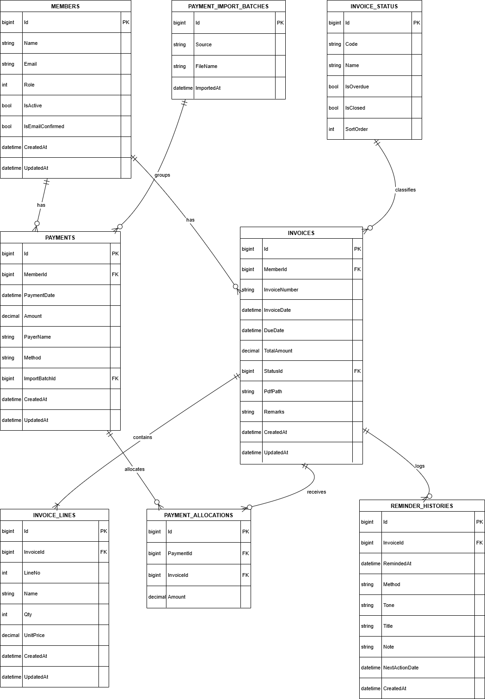
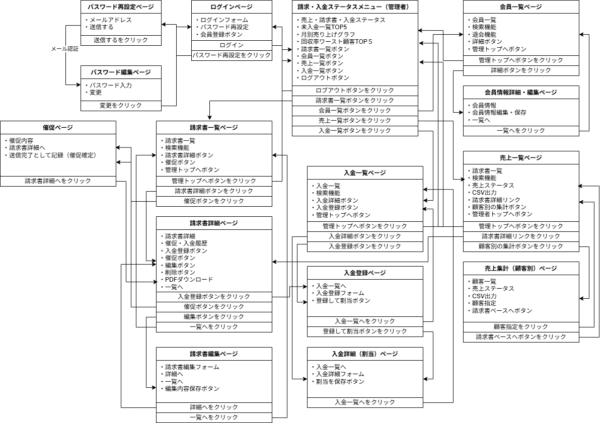
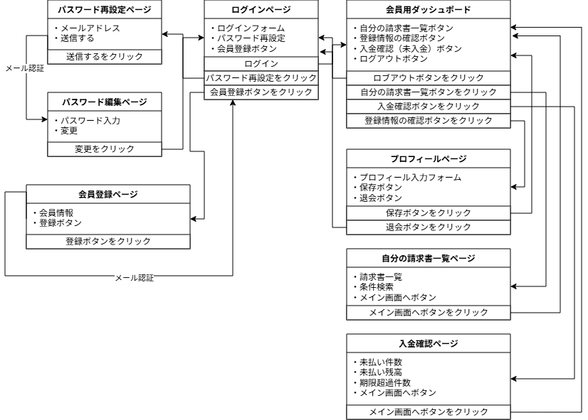

# Invoice Management System (Lite)

請求書の発行・入金管理を行う **業務向けWebアプリケーション** です。  
管理者と会員の権限を分離し、請求状況・入金状況を一元管理できます。

※ 本リポジトリは **実務を想定した Lite 版** として、  
　コア機能（請求・入金・集計）にフォーカスしています。

## 想定利用規模（参考）

- 管理者：1〜数名
- 会員：数十〜数百名程度
- 中小規模事業者を想定

---

## デモURL

- **フロントエンド（操作画面）**  
  https://invoice-naoki-app-front-b97fea6c721d.herokuapp.com/auth/login

- **バックエンド API**  
  https://invoice-naoki-app-api-333afef82093.herokuapp.com  
  Health Check: https://invoice-naoki-app-api-333afef82093.herokuapp.com/health

---

## デモアカウント

| 区分 | メールアドレス | パスワード |
|----|----|----|
| 管理者 | admin@example.com | Admin1234! |
| 会員 | member@example.com | Member1234! |

---

## スクリーンショット

### 管理者ダッシュボード
売上・未入金・請求数・回収率などを集約し、請求・入金状況を一目で把握できる管理者向けダッシュボードです。  


---

### 請求書一覧（管理者）
請求番号・会員・ステータス・期間で検索でき、日常的な請求管理業務を想定した一覧画面です。  


---

### 請求書詳細・入金状況
請求金額・入金履歴・残額を確認でき、一部入金から完済までの状態遷移を確認できます。  


---

### 入金割当（部分入金対応）
1件の入金を複数の請求書に割り当て可能で、実務を想定した柔軟な入金管理に対応しています。  


---

### 会員用ダッシュボード（任意）
会員自身が請求書と入金状況を確認できる画面で、管理者と会員の権限分離を実装しています。  


---

## 主な機能

### 管理者
- 会員管理（一覧・詳細）
- 請求書の発行・編集
- 請求書PDF出力
- 入金登録（全額／一部）
- 入金状況の自動判定（未入金／一部入金／入金済み）
- 月次・会員別の売上集計
- CSVエクスポート

### 会員
- 自身の請求書一覧・詳細確認
- 支払状況の確認

---

## API使用箇所（Frontend × Backend）

本システムでは、フロントエンド（Next.js）から
バックエンド（ASP.NET Core）へ REST API を通じてデータ連携を行っています。

主な API 使用箇所は以下のとおりです。

### 管理者機能
- 管理者ダッシュボード  
  - 売上集計・未入金額・回収率の取得
- 請求書一覧 / 詳細  
  - 請求書情報・ステータス・入金状況の取得
- 入金登録 / 入金割当  
  - 入金データの登録および請求書への割当更新
- CSVエクスポート  
  - 集計結果の取得

### 会員機能
- 会員用ダッシュボード  
  - 自身の請求書一覧・入金状況の取得
- 請求書詳細  
  - 支払状況の確認

認証には JWT を使用し、API レベルで管理者 / 会員の権限制御を行っています。

---

## 技術スタック

### Frontend
- Next.js (App Router)
- TypeScript
- Tailwind CSS

### Backend
- ASP.NET Core (.NET 8)
- Entity Framework Core
- JWT認証

### Database
- PostgreSQL  
  - ローカル：Docker  
  - 本番：Heroku Postgres（マネージドDB）

### Infrastructure
- Frontend：Heroku
- Backend：Heroku

---

## 設計資料（Architecture）

本システムの設計意図・全体構成については、以下のドキュメントにまとめています。

- [Architecture Overview（設計意図・全体構成）](./docs/architecture.md)

あわせて、業務フローおよびデータ構造を以下の図で整理しています。

### ER図（概要）


### 管理者 画面遷移


### 会員 画面遷移



---

## 技術的設計ポイント（まとめ）

- バックエンドは **Layered Architecture** を採用
  - Domain / Application / Infrastructure の責務分離
- ステータスは DB に保持せずロジックで判定
  - 未入金 / 一部入金 / 入金済み を動的に計算
- 一部入金対応を可能にするため PAYMENT_ALLOCATIONS を導入
- フロントエンドは JWT + クライアント側権限制御

---

## データベース管理方針

- スキーマ管理は **EF Core Migrations** を使用
- 完成SQLファイルは管理せず、差分管理を採用
- 本番DBはマネージドDBのバックアップ機構に依存

---

## リポジトリ構成

```text
invoice-management-system-lite/
├─ frontend/   # Next.js
├─ backend/    # ASP.NET Core
├─ docs/
│  └─ screenshots/
│     ├─ A-admin-dashboard.png
│     ├─ B-invoice-list.png
│     ├─ C-invoice-detail.png
│     ├─ D-payment-allocation.png
│     └─ F-member-dashboard.png
└─ README.md   # 本ドキュメント

```
---

## 自動テスト方針（今後の改善）

本システムでは、Lite 版として業務設計・実装を優先しており、
現時点では自動テストは未実装としています。

今後の改善として、以下の段階的なテスト導入を想定しています。

### バックエンド
- ドメインロジックの単体テスト
  - 請求ステータス自動判定ロジック
  - 入金割当（Payment Allocation）の計算処理
- API 単体テスト（認証・権限制御含む）

### フロントエンド
- 重要画面（ログイン・請求書一覧・詳細）の E2E テスト
- 管理者 / 会員の権限による表示制御確認

テストは「全体網羅」ではなく、
**業務上の重要度が高いロジックから優先的に追加**する方針としています。

---

## 補足
- 本アプリは 学習目的ではなく、業務アプリ設計の再現 を目的としています
- 実運用を想定した機能拡張（締め処理、権限拡張など）は Lite 版では省略しています
  
※ 設計資料（ER図・状態遷移図）は /docs 配下にまとめて掲載しています。

---
