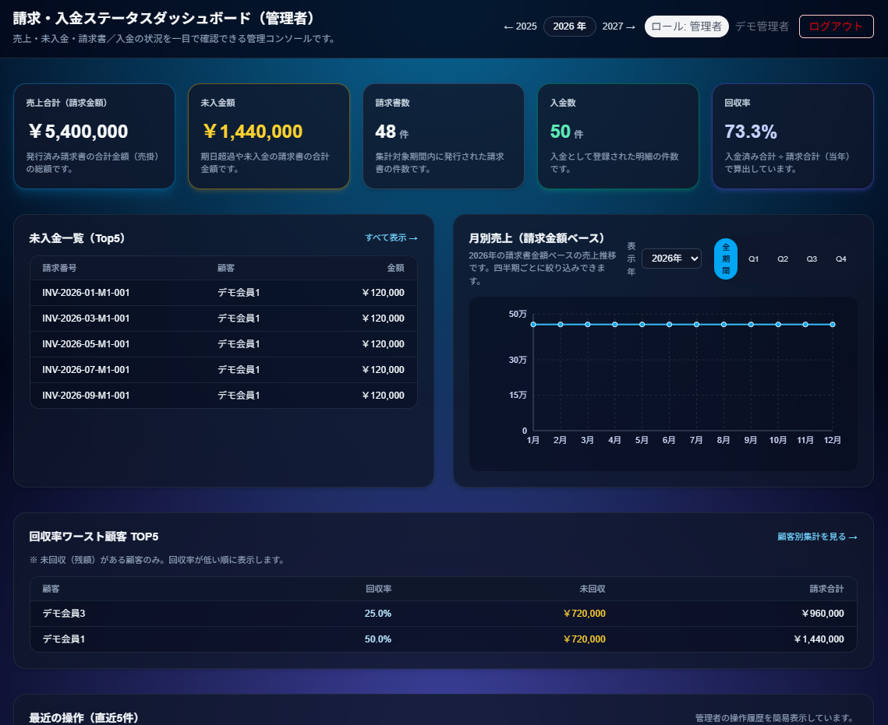
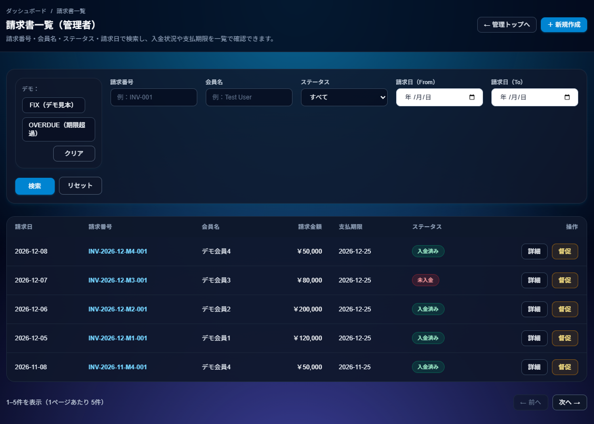
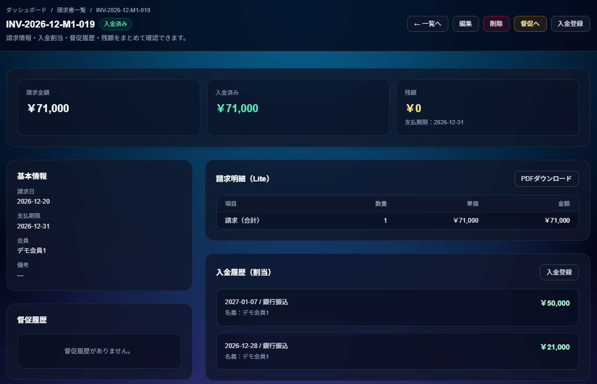
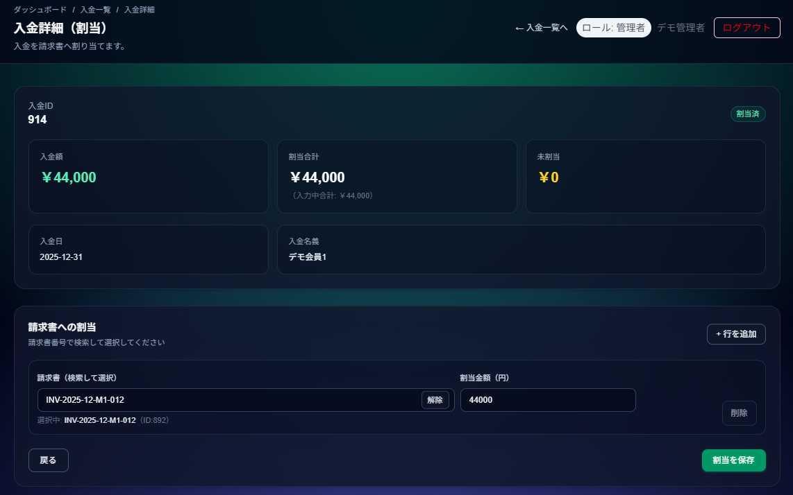
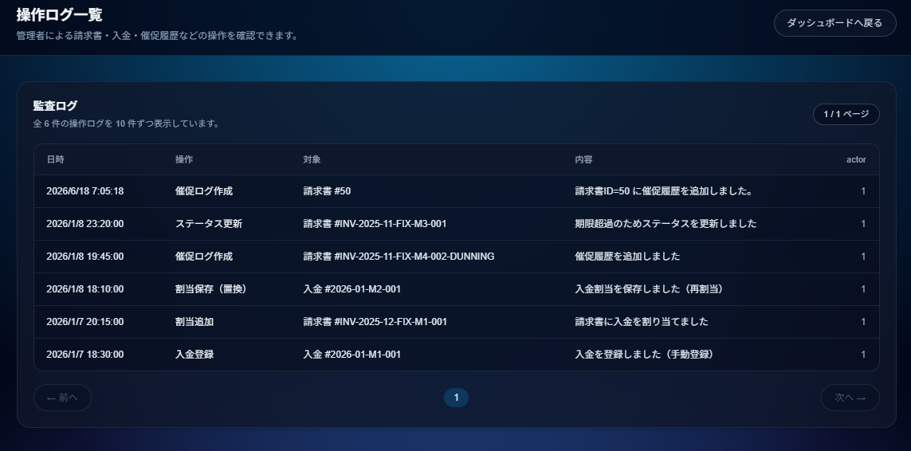
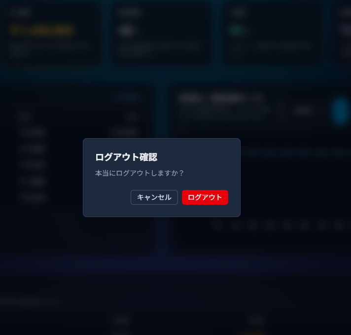
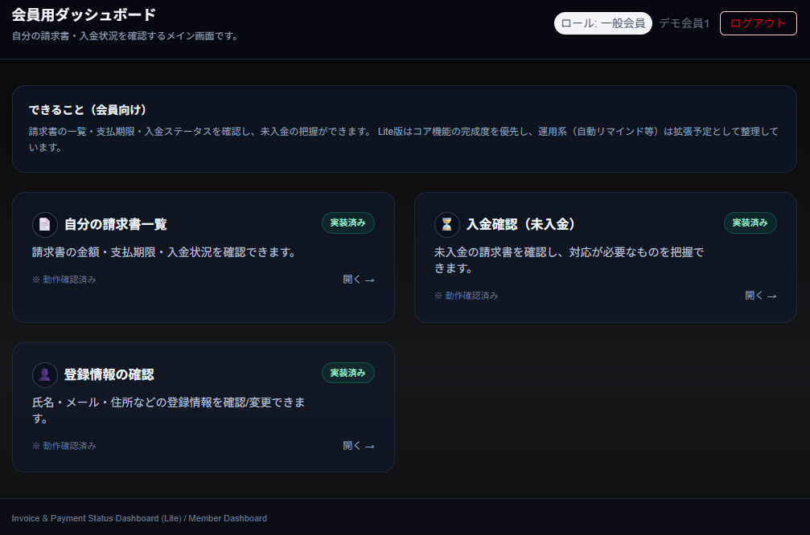
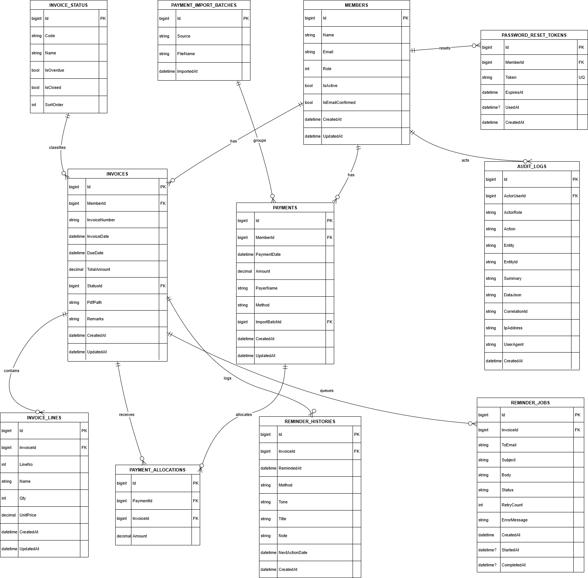
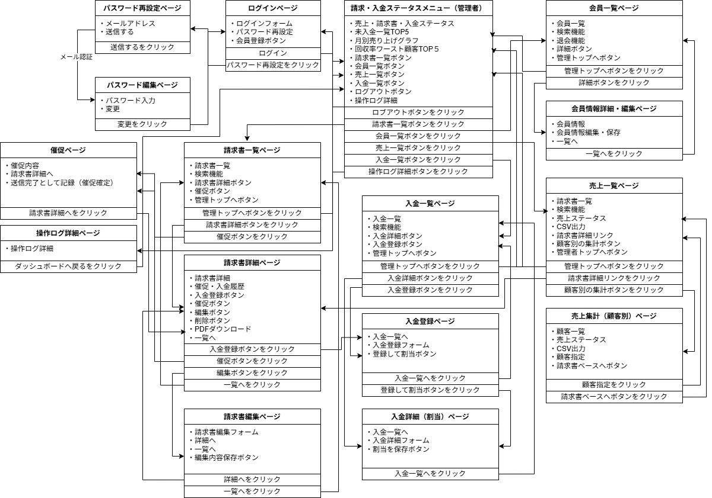
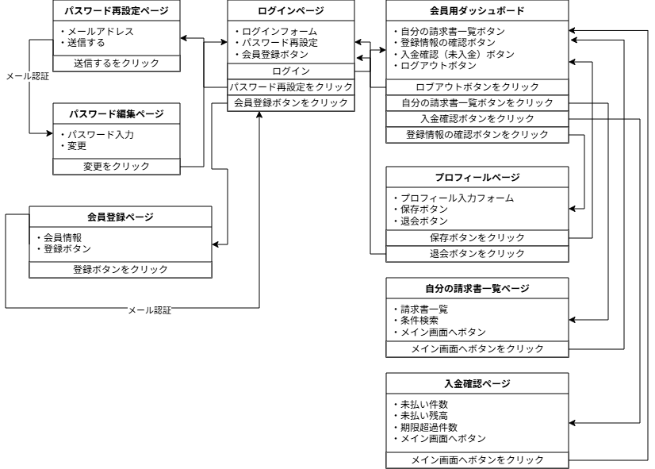

# Invoice Management System (Lite)

[](https://github.com/fewioaghwrao/Invoice-management-system-lite/actions/workflows/ci.yml)
[](https://github.com/fewioaghwrao/Invoice-management-system-lite/actions/workflows/azure-static-web-apps-delightful-dune-0bf9e7300.yml)


## 概要
**請求・入金管理業務において発生しがちな課題を整理し、  
管理者／会員の権限分離・入金ステータス管理・集計業務までを再現した業務向けWebアプリです。**

本システムは、
「請求・入金管理を Excel や属人的な運用から脱却したい中小規模事業者」を想定し、
**業務フロー・権限設計・状態管理を重視して設計・実装**しています。

※ 本リポジトリは **中核機能に絞った Lite 版** として、  
　請求・入金・集計という**業務の中核に絞って実装**しています。

## 背景・問題意識（Why）
 請求・入金管理業務では、以下のような課題が発生しやすいと考えました。
 - 請求書と入金情報が分断され、入金状況の把握に手間がかかる
 - 一部入金・複数請求への入金割当など、**Excel では管理が破綻しやすい**
 - 管理者と顧客（会員）で**見せる情報・操作できる範囲が異なる**
 - 集計や月次確認が**人手作業・属人化**しやすい
 - PDF 出力・再発行などの帳票周りが後回しになりがち
   
これらを踏まえ、**「状態（未入金／一部入金／入金済み）」を中心に据えた業務設計**を行いました。

## 解決方針（What / How）
本システムでは、以下の方針で設計・実装しています。
- 管理者／会員の権限分離を API レベルで厳密に管理
- 入金ステータスは単純な手入力フラグではなく、**入金割当（Payment Allocation）をもとに再計算して管理**
- 一部入金・複数請求への割当を前提とした**データ設計**
- フロントエンドとバックエンドを分離し、**業務ロジックはすべてバックエンドに集約**
- 本番相当環境（Heroku）での**結合テストを前提とした実装**

## 実装結果・得られた状態（Result）
- 管理者／会員ともに**請求・入金状況を一貫したUIで把握可能**
- 一部入金から完済までの**状態遷移を自動で管理**
- PDF 出力（管理者／会員）を含む帳票処理が安定動作
- 権限・ルーティングの責務が整理され、**今後の機能拡張（再発行・締め処理）に耐えうる構成**

## 想定利用規模（参考）

- 管理者：1〜数名
- 会員：数十〜数百名程度
- 中小規模事業者を想定

---

## デモURL

本システムは、フロントエンドとバックエンドを分離して公開しています。

| 区分                    | URL                                                                                       |
| ----------------------- | ----------------------------------------------------------------------------------------- |
| フロントエンド（Vercel） | https://invoice-management-system-lite-o7halmnaz-fewioaghwrao.vercel.app/auth/login       |
| フロントエンド（Azure）  | https://delightful-dune-0bf9e7300.7.azurestaticapps.net/auth/login                        |
| バックエンド API         | https://invoice-app-api-b1a73aa4f113.herokuapp.com                                        |
| Health Check             | https://invoice-app-api-b1a73aa4f113.herokuapp.com/health                                 |
| Swagger                  | https://invoice-app-api-b1a73aa4f113.herokuapp.com/swagger                                |

* Frontend：Vercel / Azure Static Web Apps（Next.js）
* Backend API：Heroku（ASP.NET Core）
* Database：Heroku Postgres

---

## デモアカウント

| 区分 | メールアドレス | パスワード |
|----|----|----|
| 管理者 | admin@example.com | Admin1234! |
| 会員 | member@example.com | Member1234! |

---

## アーキテクチャ構成

本システムは、実務で一般的な Web アプリケーション構成を想定し、  
**フロントエンド（Next.js）とバックエンド（ASP.NET Core）を分離**しています。

### 構成概要
- **フロントエンド**
  - 画面表示
  - ユーザー入力
  - 画面状態管理

- **バックエンド**
  - 認証・認可（JWT）
  - 業務ロジック
  - データベースアクセス

フロントエンドとバックエンドは **REST API による通信**を行っており、

- 将来的な画面追加
- モバイルアプリ対応
- 複数クライアント（Web / App）対応

といった **拡張性を考慮した設計**としています。

---

## スクリーンショット

### 管理者ダッシュボード
売上・未入金・請求数・回収率などを集約し、請求・入金状況を一目で把握できる管理者向けダッシュボードです。  


---

### 請求書一覧（管理者）
請求番号・会員・ステータス・期間で検索でき、日常的な請求管理業務を想定した一覧画面です。  


---

### 請求書詳細・入金状況
請求金額・入金履歴・残額を確認でき、一部入金から完済までの状態遷移を確認できます。  


---

### 入金割当（部分入金対応）
1件の入金を複数の請求書に割り当て可能で、実務を想定した柔軟な入金管理に対応しています。  


---

### 操作ログ一覧（監査ログ）
管理者による請求・入金・催促履歴などの操作を一覧で確認できます。  
いつ、誰が、どの対象に対して、どのような操作を行ったかを記録し、運用時の追跡性を高めています。  


---

### ログアウト確認
誤操作によるログアウトを防ぐため、ログアウト時には確認ダイアログを表示します。  
認証状態の破棄と画面遷移を明確に分離し、利用者が意図してログアウトできるUIとしています。  


---

### 会員用ダッシュボード（任意）
会員自身が請求書と入金状況を確認できる画面で、管理者と会員の権限分離を実装しています。  


---

## 主な機能

### 管理者
- 会員管理（一覧・詳細）
- 請求書の発行・編集
- 請求書PDF出力
- 入金登録（全額／一部）
- 入金状況の自動判定（未入金／一部入金／入金済み）
- 月次・会員別の売上集計
- CSVエクスポート
- 操作ログ確認（請求・入金・催促履歴などの監査ログ）

### 会員
- 自身の請求書一覧・詳細確認
- 自身の請求書PDF取得
- 支払状況の確認
- プロフィール確認・更新
- 退会

---

## API使用箇所（Frontend × Backend）

本システムでは、フロントエンド（Next.js）から
バックエンド（ASP.NET Core）へ REST API を通じてデータ連携を行っています。

主な API 使用箇所は以下のとおりです。

### 管理者機能
- 管理者ダッシュボード  
  - 売上集計・未入金額・回収率の取得
- 請求書一覧 / 詳細  
  - 請求書情報・ステータス・入金状況の取得
- 入金登録 / 入金割当  
  - 入金データの登録および請求書への割当更新
- CSVエクスポート  
  - 集計結果の取得
- 操作ログ一覧
  - 請求・入金・催促履歴などの監査ログ取得

### 会員機能
- 会員用ダッシュボード  
  - 自身の請求書一覧・入金状況の取得
- 請求書詳細  
  - 支払状況の確認

認証には JWT を使用し、API レベルで管理者 / 会員の権限制御を行っています。

※ すべての業務ロジック・権限制御はバックエンド API 側で実施し、
   フロントエンドは状態表示と操作に専念する構成としています。

---

## 実装で直面した課題と対応（抜粋）

- 管理者側のみ PDF 出力が失敗する不具合が発生  
  - 原因：Next.js App Router の params（Promise）未処理、ルート設計の混在、管理者／会員でのAPI責務差
  - 対応：管理者用 PDF を `/invoices/[id]/pdf` 専用ルートとして分離し、責務を整理

- 本番相当環境（Heroku）で PDF の日本語が文字化け  
  - 対応：QuestPDF に日本語フォントを埋め込み、ローカル／Heroku 両方で正常表示を確認

---

## 動作確認・結合テスト（Azure Frontend × Heroku API）

本番公開環境特有の問題（認証・認可・CORS・PDF出力・文字化け等）を検証するため、
ローカル環境だけでなく、公開環境での結合テストを重視しています。

本アプリケーションでは、

* フロントエンド：Azure Static Web Apps（Next.js）
* バックエンド API：Heroku（ASP.NET Core）
* データベース：Heroku Postgres

という構成で、クラウドサービスをまたいだ結合テストを実施しています。

### 実施内容（抜粋）
- 管理者 / 会員のログインおよびロール判定
- 管理者ダッシュボード／会員ダッシュボードの表示制御
- 管理画面への不正アクセス防止（権限分離）
- API 通信状態（401 / 403 / 500 が発生しないこと）
- 本番環境（Heroku）での画面・API統合動作確認

詳細な手順・結果・スクリーンショットについては、  
以下のドキュメントにまとめています。

- ▶ **[結合テスト結果（Heroku 本番相当環境）](./docs/Integration_test.md)**

※ 自動テストとは別に、  
　想定される画面操作を通した手動結合テストも重視しています。

---

## 技術スタック

### Frontend
- Next.js (App Router)
- TypeScript
- Tailwind CSS

### Backend
- ASP.NET Core (.NET 8)
- Entity Framework Core
- JWT認証

### Database
- PostgreSQL
  - ローカル：Docker
  - 本番相当環境：Heroku Postgres（Managed）

※ Azure 環境ではフロントエンド検証を目的としており、  
バックエンド API / DB は Heroku 側を利用しています。

## Azure と Heroku を併用している理由

本システムでは、クラウド環境の役割を分けることで
開発・検証・コストのバランスを取りながら運用できる構成としています。

### Heroku（バックエンド / データベース）
Heroku はアプリケーションとデータベースを一体で管理できる PaaS であり、
以下の理由から **API と DB を配置する本番相当環境**として採用しています。

- ASP.NET Core API を簡潔にデプロイできる
- PostgreSQL（Heroku Postgres）をマネージドで利用できる
- ローカル環境（Docker PostgreSQL）との互換性が高い
- アプリケーションと DB を同一プラットフォームで統合管理できる

そのため、本システムでは  
**API + DB を Heroku 上に配置し、本番相当環境として結合テストを実施しています。**

---

### Infrastructure（環境別）

#### 公開デモ環境

- Frontend：Vercel / Azure Static Web Apps
- Backend API：Heroku
- Database：Heroku Postgres
- 用途：
  - 公開デモ
  - 認証・認可・CORSの確認
  - PDF出力・日本語表示の確認
  - フロントエンド／バックエンド分離構成の検証

---

### Azure（フロントエンド）
Azure では **Next.js フロントエンドのホスティング環境として Static Web Apps を利用**しています。

これは以下の点を検証する目的があります。

- Next.js アプリケーションの Azure Static Web Apps での運用
- 静的・JAMstack 構成のクラウド配置
- フロントエンドとバックエンドを分離した構成での API 通信
- Microsoft 系クラウド環境での Web アプリ運用

---

### 役割分担

本プロジェクトでは、以下の役割分担でクラウドを利用しています。

| 役割 | サービス |
|---|---|
| フロントエンド | Vercel / Azure Static Web Apps |
| バックエンド API | Heroku |
| データベース | Heroku Postgres |

この構成により、

- フロントエンド / バックエンド分離構成
- REST API ベースの通信設計
- クラウド環境をまたいだアプリケーション連携

といった、実務でも一般的なアーキテクチャを再現しています。

## デプロイ / 環境（現状）

## デプロイ / 環境（現状）

### Frontend（Vercel）

- URL：
  https://invoice-management-system-lite-o7halmnaz-fewioaghwrao.vercel.app/auth/login
- Framework：Next.js（App Router）
- Root Directory：`frontend`
- 環境変数：
  - `NEXT_PUBLIC_API_BASE_URL=https://invoice-app-api-b1a73aa4f113.herokuapp.com`

### Frontend（Azure Static Web Apps）

- URL：
  https://delightful-dune-0bf9e7300.7.azurestaticapps.net/auth/login
- Framework：Next.js（App Router）
- 環境変数：
  - `NEXT_PUBLIC_API_BASE_URL=https://invoice-app-api-b1a73aa4f113.herokuapp.com`

### Backend API（Heroku）

- API：
  https://invoice-app-api-b1a73aa4f113.herokuapp.com
- Health Check：
  https://invoice-app-api-b1a73aa4f113.herokuapp.com/health
- Swagger：
  https://invoice-app-api-b1a73aa4f113.herokuapp.com/swagger
- Runtime：ASP.NET Core（.NET 8）
- Database：Heroku Postgres

### その他
- CORS：
  - Heroku API 側で、Azure Frontend の URL を許可
- Health Check：
  - GET /health

---

## 設計資料（Documents）

本システムでは、要件定義から基本設計、詳細設計、ER図・画面遷移図までを整理し、
請求・入金管理業務における要件・設計意図・実装仕様を段階的に確認できるようにしています。

### 設計書

| ドキュメント                                            | 内容                                        |
| ------------------------------------------------- | ----------------------------------------- |
| [要件定義書](./docs/design/requirements-definition.md) | システム化の背景、業務要件、機能要件、非機能要件、対象範囲を整理          |
| [基本設計書](./docs/design/basic-design.md)            | システム構成、機能設計、画面設計、データ設計概要、権限設計を整理          |
| [詳細設計書](./docs/design/detail-design.md)           | API、DB、業務ロジック、PDF/CSV、認証・認可、テスト設計を実装寄りに整理 |
| [Architecture Overview](./docs/architecture.md)   | 設計意図、全体構成、技術選定、Lite版としての方針を整理             |
| [結合テスト結果](./docs/Integration_test.md)             | Heroku本番相当環境での画面・API・認証・権限制御の確認結果         |

### 図・ダイアグラム

あわせて、業務フローおよびデータ構造を以下の図で整理しています。

#### ER図（概要）



#### 管理者 画面遷移



#### 会員 画面遷移



---

## 技術的設計ポイント（まとめ）

- バックエンドは **Layered Architecture** を採用
  - Domain / Application / Infrastructure の責務分離
- 一部入金対応を可能にするため PAYMENT_ALLOCATIONS を導入
- フロントエンドは JWT + クライアント側権限制御
- 請求ステータスは `Invoices.StatusId` として保持しつつ、入金割当の変更時に再計算する
  - 未入金 / 一部入金 / 入金済み / 期限超過 を入金割当と支払期限から判定
  - 入金割当を正として扱うことで、後からの修正・再計算に耐える設計とする

---

## データベース管理方針

- スキーマ管理は **EF Core Migrations** を使用
- 完成SQLファイルは管理せず、差分管理を採用
- 本番DBはマネージドDBのバックアップ機構に依存

---
## CI / 品質管理（GitHub Actions）
本リポジトリでは、**GitHub Actions を用いた CI（継続的インテグレーション）** を導入し、
ビルド品質および基本的なコード品質を自動で確認しています。

### CI 構成概要
- 対象ブランチ：main、feature/**、fix/**、develop などへの push / pull request
- フロントエンド（Next.js）
  - 依存関係のインストール（npm ci）
  - ESLint による静的解析
  - Jest / Testing Library によるテスト
  - ビルド確認（npm run build）
- バックエンド（ASP.NET Core）
  - restore / build / test の自動実行（.NET 8）
  - 入金割当・請求ステータス再計算など、業務上重要なロジックについて単体テストを実装し CI 上で自動実行

### 設計方針
本プロジェクトは既存コードに対して CI を後付けする想定のため、
以下の方針で段階的に品質管理を行っています。
- build / test は **必須（CI 失敗条件）**
  - バックエンドの業務ロジック変更時に自動テストで検知できることを重視
- lint は **品質の可視化を目的として実行**
  - 既存コードのため、現時点では lint エラーで CI を停止しない設計
  - 将来的にルールを段階的に厳格化する前提
この構成により、
- アプリケーションが ビルド可能な状態であること
- 品質上の課題（any 型、hooks の使い方など）が CI 上で可視化されること
を両立しています。
### ワークフロー定義
CI の定義は以下に記載しています。
- .github/workflows/ci.yml

※ CI は「失敗させること」が目的ではなく、
　品質状況を共有し、改善判断をしやすくするための仕組みとして運用しています。

### 認可（Authorization）に関するテストについて

本システムでは、管理者 / 会員の権限分離が業務上重要であるため、  
バックエンド API に対して **認可（403 Forbidden / 404 NotFound）を検証する Integration Test** を実装しています。

- ASP.NET Core の `WebApplicationFactory` を用いて API を起動
- テスト環境専用の設定（`appsettings.Testing.json`）を使用
- JWT はログイン API を経由せず、テスト内で **ロール（Admin / Member）を切り替えて生成**
- テスト専用の PostgreSQL（GitHub Actions 上で起動）を使用し、本番データには依存しない形で CI 上でも安定して再現可能な構成

これにより、
- 誤ったロールで管理者 API にアクセスした場合に **必ず 403 が返ること**
- 認可ロジックが将来のリファクタリングで壊れないこと

を CI 上で自動検証しています。

---
## リポジトリ構成

```text
invoice-management-system-lite/
├─ frontend/                      # Next.js フロントエンド
├─ backend/                       # ASP.NET Core Backend API
├─ docs/
│  ├─ design/
│  │  ├─ requirements-definition.md # 要件定義書
│  │  ├─ basic-design.md            # 基本設計書
│  │  └─ detail-design.md           # 詳細設計書
│  ├─ diagram/
│  │  ├─ er-diagram.drawio.png      # ER図
│  │  ├─ admin-diagram.drawio.png   # 管理者画面遷移図
│  │  └─ member-diagram.drawio.png  # 会員画面遷移図
│  ├─ screenshots/
│  │  ├─ A-admin-dashboard.png
│  │  ├─ B-invoice-list.png
│  │  ├─ C-invoice-detail.png
│  │  ├─ D-payment-allocation.png
│  │  ├─ F-member-dashboard.png
│  │  ├─ G-operation-log-list.png
│  │  └─ H-logout-confirm.png
│  ├─ architecture.md              # 設計意図・全体構成
│  └─ Integration_test.md          # 結合テスト結果
└─ README.md                       # 本ドキュメント
```

---

### 自動テスト方針

本システムでは、業務上重要なロジック、API の認証・認可、フロントエンド主要画面を対象に自動テストを整備しています。

### バックエンド
- xUnit によるサービス層の単体テスト
- WebApplicationFactory を用いた API 統合テスト
- 認証、認可、Admin / Member の権限分離
- 入金割当、請求ステータス再計算、売上集計、督促、監査ログ

### フロントエンド
- Jest / React Testing Library による画面・コンポーネントテスト
- ログイン、ダッシュボード、請求書、入金、会員、督促画面などの確認

### CI
- GitHub Actions により、フロントエンド・バックエンドの build / test を自動実行

---

## 関連リポジトリ

### WPF デスクトップクライアント

- [InvoiceSystem.Wpf](https://github.com/fewioaghwrao/InvoiceSystem.Wpf)

本リポジトリの ASP.NET Core Web API を利用する、C# / WPF 製のデスクトップクライアントです。  
Web 版とは別に、管理者・会員向けの請求書確認、入金管理、会員管理、売上確認などを  
デスクトップアプリとして操作できるように実装しています。

WPF 版では、業務画面としての一覧性、表形式データの見やすさ、  
Admin / Member ロール別の画面遷移、ダークテーマ UI、xUnit / GitHub Actions によるテスト実行を意識して構成しています。

---

## 補足
- 本アプリは、請求〜入金〜集計の業務フローを題材に、権限分離と状態管理を重視して設計・実装しています
- 実運用を想定した機能拡張（締め処理、権限拡張など）は Lite 版では省略しています
- CI / Integration Test / 認可設計まで含め、実務での運用・保守を意識して構築しています
- 現状はコスト最適化のため、Backend API / DB は Heroku に統一し、フロントエンドは Vercel と Azure Static Web Apps で公開・運用検証しています。
- Azure SQL / Azure Static Web Apps 構成も検証しましたが、常時稼働コストと運用の観点から、現状の公開デモは Backend API / DB を Heroku に統一しています（Azure はフロント運用検証として利用）。

  
※ 設計資料（ER図・状態遷移図）は /docs 配下にまとめて掲載しています。

---