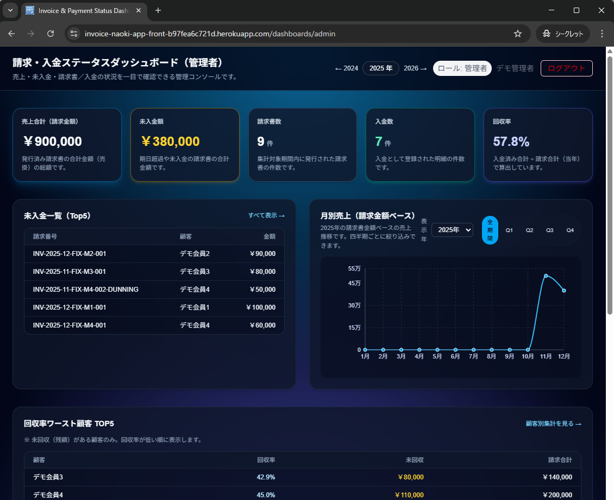

# 結合テスト結果（Heroku 本番相当環境）

本ドキュメントは  
**請求・入金ステータスダッシュボード（Lite版）** において、  
フロントエンド（Next.js）とバックエンド API（ASP.NET Core）を  
**Heroku 上で統合した状態**で実施した結合テストの結果をまとめたものです。

画面表示・認証・権限分離・業務フローが  
本番環境を想定した形で正しく動作することを確認しています。

---

## 対象環境

- Frontend：Next.js（Heroku）
- Backend API：ASP.NET Core（Heroku）
- Database：Heroku Postgres
- 認証方式：JWT（Cookie）
- 実施日：2025-12-30
- ブラウザ：Chrome（シークレットモード）

---

## テスト方針

- 単体テスト（JUnit / xUnit 相当）ではなく  
  **「画面操作を通した結合テスト」**を実施
- 実務で想定される操作フローを再現
- 権限分離は **画面制御 + API 制御の両面**で確認

---

## テスト項目と結果

### 1. 認証・ロール判定

| 操作 | 期待結果 | 結果 |
|----|----|----|
| Admin でログイン | 管理者として認識される | OK |
| Member でログイン | 一般会員として認識される | OK |

---

### 2. 管理者ダッシュボード表示

**操作**
- Admin アカウントでログイン
- `/dashboards/admin` にアクセス

**期待**
- 管理者用ダッシュボードが表示される

**結果**
- 管理者向け KPI・一覧・グラフが正常に表示されることを確認  
- Network 上でエラー（401 / 403 / 500）が発生していないことを確認

📸 スクリーンショット（Heroku / Admin）

---

### 3. 会員ダッシュボード表示

**操作**
- Member アカウントでログイン
- `/dashboards/member` にアクセス

**期待**
- 会員向けダッシュボードが表示される  
- 管理者向け情報は表示されない

**結果**
- 会員向け機能（自分の請求書／入金確認）が表示されることを確認  
- 管理者専用 UI が表示されないことを確認

📸 スクリーンショット（Heroku / Member）

---

### 4. 管理画面への不正アクセス防止（権限分離）

**操作**
- Member アカウントで管理者用 URL に直接アクセス

**期待**
- 管理画面は表示されない

**結果**
- Server Component による権限チェックにより  
  描画前に適切な画面へリダイレクトされることを確認  
- 不正ロールで管理画面が描画されない

※ 本実装では UX を考慮し、  
  403 エラーページを表示するのではなく  
  描画前リダイレクト方式を採用しています。

---

### 5. 通信状態の確認（Network）

**確認内容**
- 保護画面アクセス時の通信ステータス  
- 不要な 401 / 403 / 500 が発生していないこと

**結果**
- 必要な API のみが 200 で応答していることを確認

📸 スクリーンショット（Network）

---

## 総合結果

- 管理者／会員の権限分離が正しく機能している
- 本番相当環境（Heroku）で画面・API が統合動作している
- 業務想定フローにおいて致命的な不具合がないことを確認

---

## 補足（設計上のポイント）

- 管理画面は Server Component で権限チェックを実施  
  → 不正ロールの場合、描画前に制御
- UI 側の制御に加え、API 側でもロールベース認可を実装
- 実務での運用を想定し、  
  「エラー表示」より「誤操作させない UX」を優先

---

以上の結果より、  
本アプリケーションは **ポートフォリオ用途として十分な結合品質**を満たしていると判断します。

