# Reminder Batch 基本設計

## 1. 目的

本書は、Invoice Management System のリマインダーメール処理を、外部ジョブスケジューラから1回実行型バッチとして起動するための基本設計を定義する。

特定のジョブ管理製品には依存せず、JP1/AJS、cron、systemd timer 等から起動可能な構成を想定する。

対象バッチでは、以下を考慮する。

- 外部CLI起動
- 起動パラメータ
- 終了コードによる実行結果通知
- ログ出力
- 処理結果の取得
- 障害発生時の再実行
- Processing残留ジョブの復旧
- 同時起動時の二重処理防止
- 完了済みジョブの再処理防止
- API内BackgroundServiceとの責務分離

> **設計上の前提**  
> 本設計は、現時点で実装・ローカルPostgreSQL・Mailtrapにより確認済みの内容を反映する。  
> VPS上のsystemd / cron実行、およびJP1/AJS本体との連携は後続フェーズとする。

---

## 2. 対象処理

対象は `ReminderJobs` テーブルに登録されたリマインダーメール送信ジョブとする。

通常の処理対象条件は以下とする。

```text
Status = Pending
AND
RetryCount < 3
```

1回のバッチ起動につき、作成日時の古い順に最大10件を処理する。

```sql
ORDER BY "CreatedAt"
LIMIT 10
```

11件以上存在する場合、残件は次回のバッチ起動対象とする。

---

## 3. 起動インターフェース

### 3.1 実行形式

本番相当の起動形式：

```bash
dotnet InvoiceSystem.Batch.dll reminder --job-id <JOB_ID>
```

開発環境：

```powershell
dotnet run --project backend/InvoiceSystem.Batch -- `
  reminder `
  --job-id REMINDER-LOCAL-001
```

### 3.2 起動パラメータ

| 項目 | 必須 | 内容 |
|---|---:|---|
| `command` | 必須 | 実行するバッチ種別。初期実装は `reminder` |
| `--job-id` | 必須 | 外部ジョブ実行を識別する相関ID |

`--target-date` は初期実装では使用しない。現行ReminderJobProcessorは業務日付ではなく `Status` および `RetryCount` で処理対象を決定するためである。

### 3.3 JobIdの区別

外部実行IDとDB上のReminderJob IDは別の識別子である。

```text
外部実行ID
REMINDER-CONCURRENT-B

業務ジョブID
ReminderJobs.Id = 7
```

外部実行IDは、外部ジョブスケジューラの実行単位とBatchログを関連付けるために使用する。

---

## 4. システム構成

```text
JP1 / systemd / cron / PowerShell
              |
              | CLI起動
              v
      InvoiceSystem.Batch
              |
              v
    IReminderJobProcessor
              |
              v
    ReminderJobProcessor
        |             |
        v             v
   PostgreSQL      IEmailSender
                     |
                     v
                  Mailtrap
```

`ReminderJobProcessor` の業務処理をBatch側へコピーせず、API内Workerと外部Batchで共通利用する。

---

## 5. 処理概要

```text
Batch起動
   ↓
引数チェック
   ↓
DB接続
   ↓
stale Processing復旧
   ↓
Pendingジョブを排他的にClaim
   ↓
Processingへ更新
   ↓
DBトランザクションCOMMIT
   ↓
メール送信
   ↓
成功
 ┌───────────────┐
 │               │
Completed      送信失敗
                 ↓
          RetryCount + 1
                 ↓
       ┌────────────────┐
       │                │
 RetryCount < 3    RetryCount >= 3
       ↓                ↓
    Pending           Failed
```

メール送信中はDBトランザクションを保持しない。

---

## 6. ステータス設計

`ReminderJobs.Status` は以下を使用する。

| Status | 内容 |
|---|---|
| `Pending` | 未処理、またはメール送信失敗後の再実行待ち |
| `Processing` | Batch / Workerが処理対象として確保済み |
| `Completed` | 正常完了 |
| `Failed` | リトライ上限到達 |

基本状態遷移：

```text
Pending
  ↓ Claim
Processing
  ↓
  ├─ 成功 ─────────→ Completed
  │
  └─ 失敗
       ↓
       RetryCount + 1
       ↓
       ├─ RetryCount < 3  → Pending
       └─ RetryCount >= 3 → Failed
```

---

## 7. 再実行設計

### 7.1 Completed済みジョブ

`Completed` は通常の処理対象条件に含めない。

```text
Completed
   ↓
次回Batch
   ↓
対象外
```

処理対象が存在しない場合、Batchは終了コード `10` を返す。

正常処理の実機証跡：

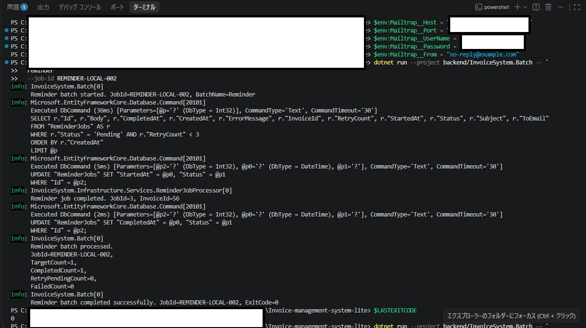

Mailtrap送信証跡：

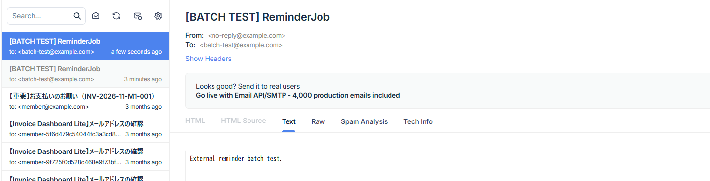

### 7.2 メール送信失敗

SMTP等の外部依存先でエラーが発生した場合：

```text
RetryCount = RetryCount + 1
```

`RetryCount < 3` の場合：

```text
Status = Pending
```

として再実行可能な状態へ戻す。

`RetryCount >= 3` の場合：

```text
Status = Failed
```

として自動再実行対象から除外する。

送信失敗後のDB状態：

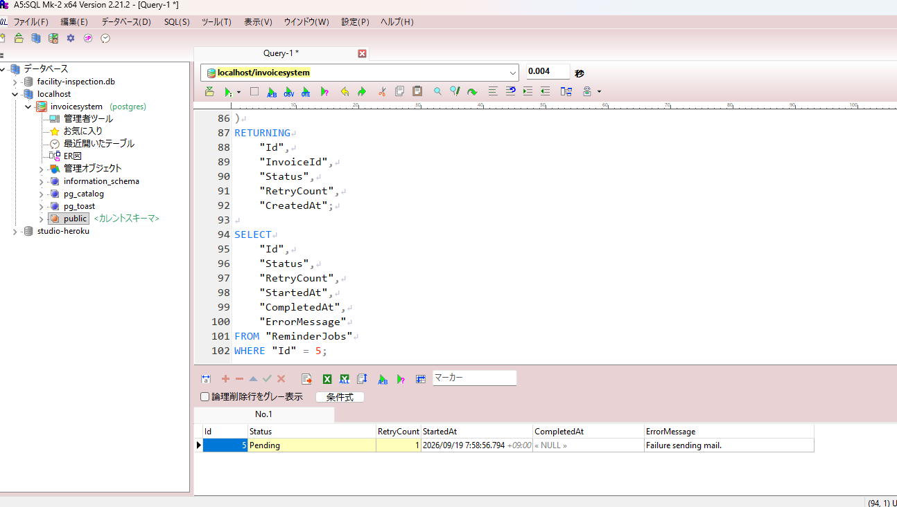

送信失敗時のBatchログ：

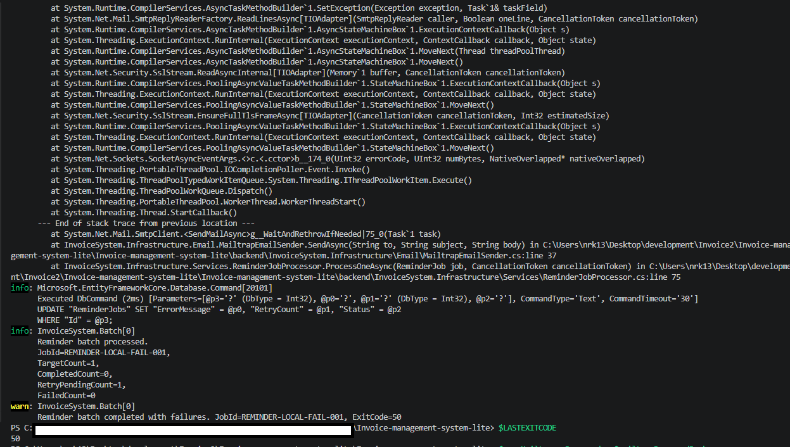

障害原因解消後の再実行結果：

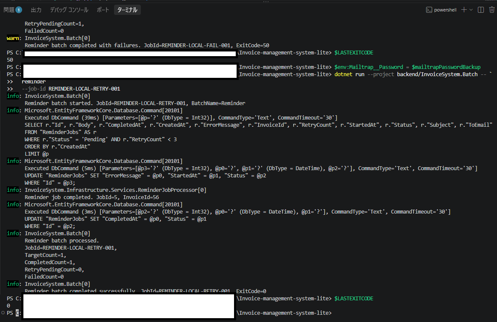

再実行完了後のDB状態：

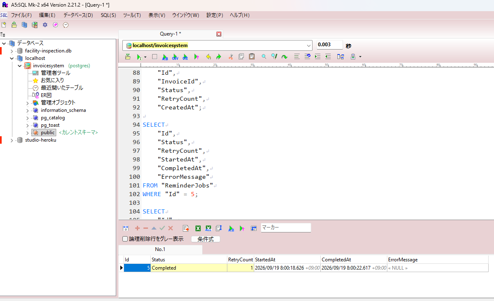

### 7.3 RetryCountの意味

`RetryCount` はメール送信処理に失敗した回数として扱う。

プロセス異常終了による stale Processing 復旧では、メール送信失敗が確定していないため `RetryCount` を増加させない。

---

## 8. Processing残留復旧

### 8.1 背景

ジョブを `Processing` へ変更した後に以下が発生すると、`Processing` のまま残留する可能性がある。

- Batchプロセス強制終了
- OS停止
- コンテナ停止
- VPS停止
- プロセスKill

通常の処理対象は `Pending` のため、復旧処理がなければ残留ジョブは再処理されない。

### 8.2 stale判定

以下を満たすジョブを stale Processing と判断する。

```text
Status = Processing
AND
StartedAt IS NOT NULL
AND
StartedAt <= 現在時刻 - 10分
AND
RetryCount < 3
```

10分以内の `Processing` は別プロセスが現在処理中である可能性があるため復旧しない。

### 8.3 復旧処理

stale Processing は一旦 `Pending` へ戻す。

```text
Status = Pending
ErrorMessage = "Recovered from stale Processing state."
```

その後、同一Batch実行内で通常のClaim対象とする。

```text
stale Processing
      ↓
Pendingへ復旧
      ↓
Claim
      ↓
Processing
      ↓
メール送信
      ↓
Completed
```

Claim時に `ErrorMessage` をクリアするため、正常完了後は `ErrorMessage = NULL` となる。

実行前：

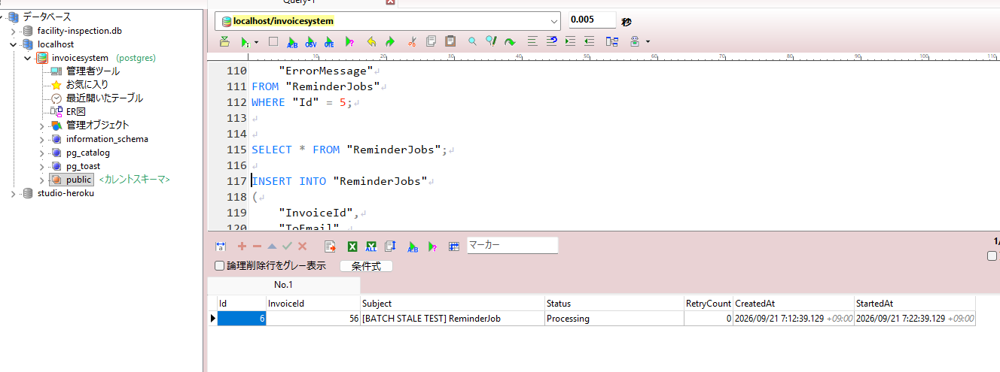

復旧・処理ログ：

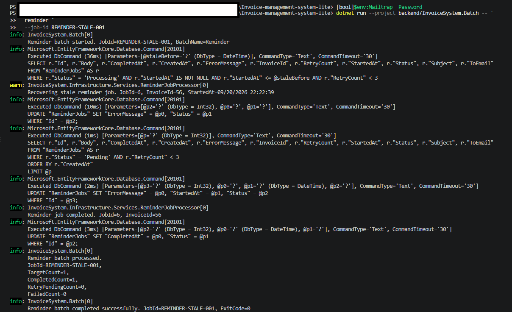

実行後：

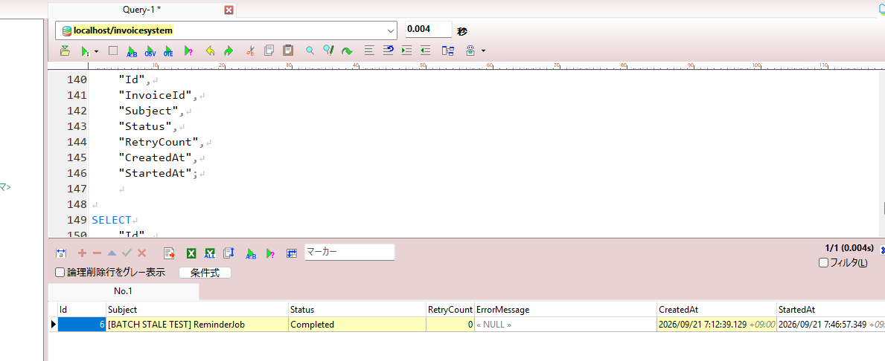

### 8.4 現時点の制約

通常の `Pending` Claimには行ロックを使用するが、`RecoverStaleProcessingJobsAsync()` 自体には専用の排他制御を設けていない。

そのため、**複数Batchが同時に stale Processing を復旧するケースについては、通常Pendingの同時取得対策とは別の競合余地が残る**。

これは後続改善項目とし、現時点で「すべての経路でExactly Onceを保証する」とはしない。

---

## 9. 同時起動時の排他制御

### 9.1 背景

排他制御を行わず複数Batchが同時起動した場合、同じ `Pending` ジョブを複数プロセスが取得する可能性がある。

```text
Batch A → Pending取得
Batch B → 同じPending取得
Batch A → メール送信
Batch B → 同じメール送信
```

通常 `Pending` ジョブの二重取得を防止するため、PostgreSQLの行ロックを使用する。

### 9.2 Claim方式

PostgreSQLでは以下のSQLで最大10件をClaimする。

```sql
SELECT *
FROM "ReminderJobs"
WHERE "Status" = 'Pending'
  AND "RetryCount" < 3
ORDER BY "CreatedAt"
LIMIT 10
FOR UPDATE SKIP LOCKED;
```

取得したジョブを同一トランザクション内で次の状態へ変更する。

```text
Status = Processing
StartedAt = 現在時刻
ErrorMessage = NULL
```

その後COMMITする。

### 9.3 SKIP LOCKED

`FOR UPDATE SKIP LOCKED` により、他プロセスがロックしている行は待機せずスキップする。

```text
              ReminderJob Id=7 / Pending
                        │
           ┌────────────┴────────────┐
           │                         │
       Batch A                   Batch B
           │                         │
 FOR UPDATE取得              FOR UPDATE試行
           │                         │
       Lock獲得               SKIP LOCKED
           │                         │
    Processingへ変更             対象なし
           │                         │
       COMMIT                  TargetCount=0
           │                    ExitCode=10
       メール送信
           │
      Completed
      ExitCode=0
```

この方式により、**通常のPending Claim経路では**同一ReminderJobの二重取得を防止する。

### 9.4 トランザクション範囲

DBロックを保持する範囲は以下までとする。

```text
Pending取得
↓
Processing更新
↓
COMMIT
```

SMTP送信中はDBトランザクションを保持しない。

SMTP通信の遅延・タイムアウトによってDBロックが長時間保持されることを避けるためである。

### 9.5 実機確認

処理前DB：

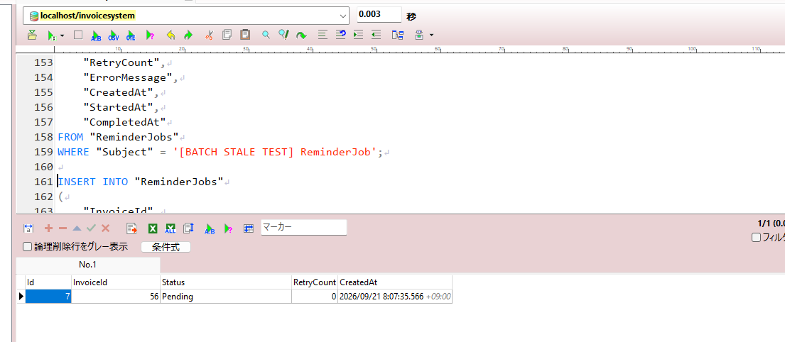

Batch A：

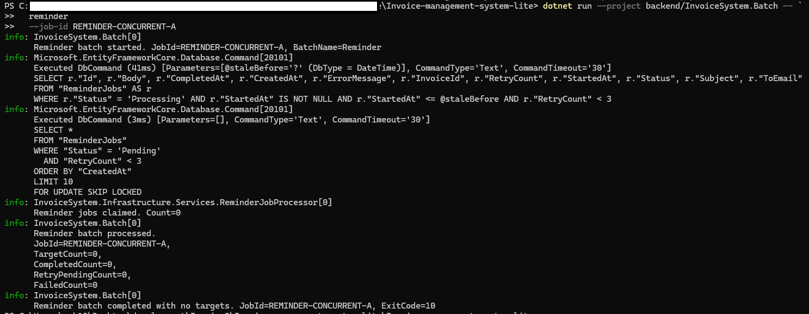

Batch B：

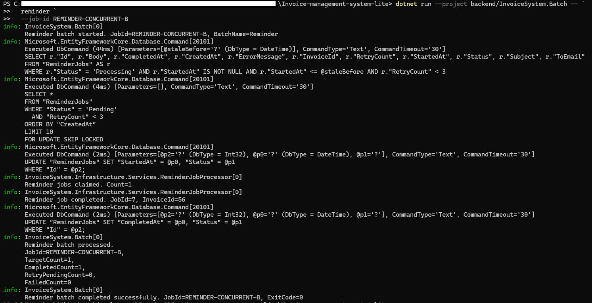

Mailtrapでは1通のみ送信されたことを確認した。

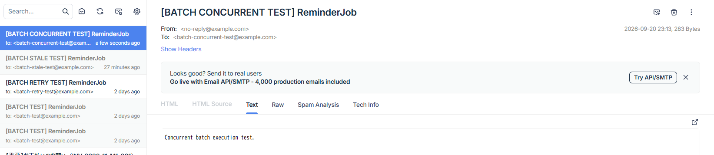

処理後DB：

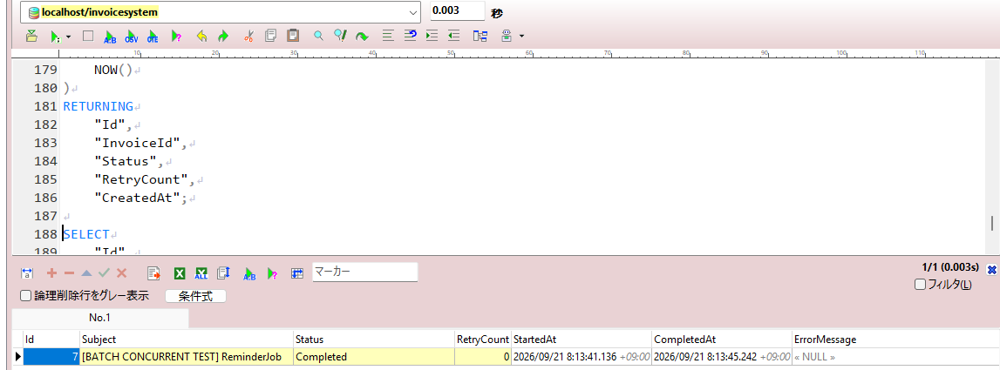

確認結果：

```text
Batch A
→ Claim Count=0
→ TargetCount=0
→ ExitCode=10

Batch B
→ Claim Count=1
→ CompletedCount=1
→ ExitCode=0

Mailtrap
→ メール1通のみ

DB
→ Id=7 がCompleted
```

A/BのどちらがClaimに成功するかは実行タイミングに依存し、固定しない。

---

## 10. 終了コード

外部ジョブスケジューラから実行結果を判定できるよう、以下の終了コードを返す。

| ExitCode | 分類 | 意味 |
|---:|---|---|
| `0` | 正常 | 対象が存在し、全対象処理が正常終了 |
| `10` | 正常 | 処理対象なし |
| `20` | 業務・起動エラー | command不正、必須パラメータ不足等 |
| `50` | システム・処理エラー | DBエラー、SMTP失敗、Retry/Failed発生等 |
| `99` | 想定外エラー | 未分類例外 |

### 10.1 正常終了

```text
TargetCount > 0
CompletedCount = TargetCount
RetryPendingCount = 0
FailedCount = 0
ExitCode = 0
```

### 10.2 対象なし

```text
TargetCount = 0
ExitCode = 10
```

要件定義に合わせ、`10` は「処理対象なしの正常終了」とする。ジョブ管理製品側で警告扱いにするかは運用設計で決定する。

### 10.3 処理失敗

```text
RetryPendingCount > 0
OR
FailedCount > 0
```

の場合、終了コード `50` とする。

---

## 11. 処理結果

`ReminderJobProcessor` は以下を `ReminderJobProcessResult` として返却する。

```text
TargetCount
CompletedCount
RetryPendingCount
FailedCount
ProcessedCount
HasTargets
HasFailures
```

ExitCodeへの変換は `InvoiceSystem.Batch` の責務とする。

```text
ReminderJobProcessor
      ↓
ReminderJobProcessResult
      ↓
InvoiceSystem.Batch
      ↓
ExitCode
```

---

## 12. ログ設計

### 12.1 必須ログ項目

要件上、以下を追跡可能とする。

- Timestamp
- LogLevel
- External JobId
- BatchName
- ReminderJob.Id
- 処理開始 / 終了
- TargetCount
- CompletedCount
- RetryPendingCount
- FailedCount
- ExitCode
- エラー内容

### 12.2 外部JobIdとReminderJob.Id

ログ上は、外部実行IDと業務ジョブIDを明確に区別することが望ましい。

設計上の名称：

```text
ExternalJobId = REMINDER-CONCURRENT-B
ReminderJobId = 7
```

### 12.3 現行実装との差分

現行ログでは、Batch側の外部実行IDとProcessor側のDB IDが、どちらも表示上 `JobId` というプロパティ名で出力されている。

例：

```text
Reminder batch started. JobId=REMINDER-CONCURRENT-B
Reminder job completed. JobId=7
```

実行証跡上は文脈で区別可能だが、可観測性向上のため、後続でProcessor側ログを `ReminderJobId` へ変更することを推奨する。

また、ローカル実行の既定Console Loggerでは、添付証跡上Timestampが出力されていない。

そのため、要件の `Timestamp` を満たすには以下のいずれかを後続で実施する。

- Console FormatterにTimestampを付与
- JSON Console Loggingを使用
- VPS/systemd運用時にjournalのTimestampを正式証跡とする

### 12.4 構造化ログ

`ILogger` のメッセージテンプレートを利用し、プロパティとして値を渡す方式を採用する。

ただし、現時点のローカルConsole出力はプレーンテキスト表示であり、**JSON形式の構造化ログ出力までは証跡化していない**。

「構造化ログ」をJSON等の機械可読形式まで要求する場合は、後続の運用設計でConsole Formatterを定義する。

---

## 13. API BackgroundServiceとの責務分離

`ReminderJobProcessor` は以下から共通利用する。

- API BackgroundService
- InvoiceSystem.Batch

外部ジョブスケジューラでBatchを運用する環境では、原則としてAPI側 `ReminderJobWorker` を無効化する。

環境変数：

```text
ReminderWorker__Enabled=false
```

アプリケーション設定としては以下に対応する。

```text
ReminderWorker:Enabled = false
```

これにより、外部ジョブ管理方式ではスケジューリング責務をBatch側へ寄せる。

なお、通常Pendingの取得については `FOR UPDATE SKIP LOCKED` が防御として機能するが、Worker無効化は責務分離と不要な競合回避のための基本運用方針とする。

---

## 14. 再実行保証と制約

SMTP送信とPostgreSQL更新は同一トランザクションにはできない。

以下のタイミングで停止した場合：

```text
SMTP送信成功
      ↓
ここでプロセス停止
      ↓
Completed更新未実施
```

メールは送信済みでもDBには `Processing` が残る可能性がある。

その後stale recoveryにより再実行されると、同一メールが再送される可能性がある。

したがって本設計は、厳密なExactly Onceではなく **At-Least-Once型** の実行特性を持つ。

完全な重複送信防止が必要な場合は以下を別途検討する。

- 外部メール送信側のIdempotency Key
- Outbox Pattern
- 送信履歴による重複チェック
- Message Queue

---

## 15. テスト方針

### 15.1 単体テスト

SQLite In-Memoryを使用する。

PostgreSQL固有の

```sql
FOR UPDATE SKIP LOCKED
```

はSQLiteでは利用できないため、単体テスト時は通常のPending取得・Processing更新経路を使用する。

現時点で以下を含む114件のテストが成功している。

- Pending正常処理
- SMTP失敗時Pending復帰
- RetryCount=3でFailed
- Completed除外
- RetryCount>=3除外
- 最大10件処理
- stale Processing復旧
- 直近Processingを復旧しない

### 15.2 PostgreSQL実DB確認

以下はローカルPostgreSQLで実機確認する。

- 正常処理
- 処理対象なし
- SMTP失敗
- SMTP復旧後の再実行
- stale Processing復旧
- `FOR UPDATE SKIP LOCKED` による同時起動排他
- Mailtrapによる重複送信有無
- ExitCode

---

## 16. 実機確認結果

| ケース | 結果 | ExitCode | 証跡 |
|---|---|---:|---|
| 正常処理 | Pending → Completed、Mailtrap送信成功 | 0 | `01`, `02` |
| Completed後の再実行 | 対象なし、重複送信なし | 10 | コマンド確認済み |
| SMTP障害 | Pendingへ復帰、RetryCount=1 | 50 | `03`～`05` |
| SMTP復旧後再実行 | 同一ReminderJobがCompleted | 0 | `06`, `07` |
| stale Processing | 10分超過を復旧しCompleted | 0 | `08`～`10` |
| Batch同時起動 | 片方のみClaim、メール1通 | 0 / 10 | `11`～`15` |

---

## 17. 証跡一覧

証跡保存先：

```text
docs/evidence/batch/
```

| No. | ファイル | 内容 |
|---:|---|---|
| 01 | `01-normal-mail-send.png` | 正常メール送信 |
| 02 | `02-normal-batch-command.png` | 正常Batch実行 |
| 03 | `03-retry-pending-db.png` | SMTP失敗後のPending / RetryCount |
| 04 | `04-retry-failure-command-1.png` | SMTP失敗ログ前半 |
| 05 | `05-retry-failure-command-2.png` | SMTP失敗ログ後半・ExitCode=50 |
| 06 | `06-retry-completed-db.png` | 再実行成功後のCompleted |
| 07 | `07-retry-success-command.png` | 再実行成功・ExitCode=0 |
| 08 | `08-stale-processing-before.png` | stale Processing実行前 |
| 09 | `09-stale-processing-command.png` | stale復旧・処理ログ |
| 10 | `10-stale-processing-after.png` | stale復旧後Completed |
| 11 | `11-concurrent-before.png` | 同時起動テスト前Pending |
| 12 | `12-concurrent-batch-a.png` | Batch A（Claimなし） |
| 13 | `13-concurrent-batch-b.png` | Batch B（Claim成功） |
| 14 | `14-concurrent-mail.png` | Mailtrap 1通のみ |
| 15 | `15-concurrent-after.png` | 同時起動テスト後Completed |

---

## 18. 要件定義との整合性

`01_requirements.md` との対応は以下とする。

| 要件 | 基本設計での対応 |
|---|---|
| CLI外部起動 | 3章 |
| 起動パラメータ | 3章 |
| ExitCode | 10章 |
| ログ | 12章 |
| 処理結果 | 11章 |
| 再実行 | 7章 |
| Retry | 7章 |
| Processing残留復旧 | 8章 |
| 二重実行防止 | 9章 |
| Worker切替 | 13章 |

現時点の未完了・要改善事項：

1. ローカルConsole LoggerのTimestamp出力
2. 外部JobIdとReminderJob.Idのログプロパティ名の明確化
3. JSON等の構造化ログ形式を正式要件とする場合のFormatter設定
4. stale Processing復旧処理自体の同時実行排他強化
5. VPS上のsystemd / cron外部起動
6. JP1/AJS本体との連携は対象外のまま

---

## 19. 今後の拡張候補

- 10件を超える場合の連続チャンク処理
- `BatchExecution` 等の実行履歴テーブル
- External JobIdのDB保存
- Processorログの `ReminderJobId` 化
- Console / JSONログのTimestamp整備
- stale Processing復旧処理自体の排他制御強化
- Outbox Pattern
- Idempotency Key
- DockerでのBatch実行
- VPS上でのsystemd / cron実行
- JP1/AJS等の外部ジョブ管理製品との連携
