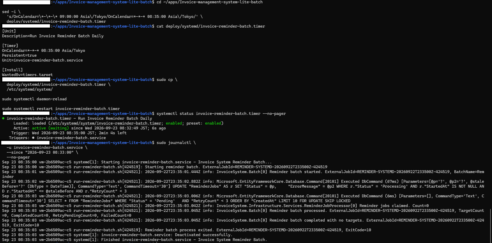

# Reminder Batch 詳細設計

## 1. 目的

本書は、`docs/batch/01_requirements.md` および `docs/batch/02_basic-design.md` を前提として、
Invoice Management System のリマインダーメール外部Batchについて、実装単位の詳細設計を定義する。

対象は以下とする。

- `InvoiceSystem.Batch`
- `IReminderJobProcessor`
- `ReminderJobProcessor`
- `ReminderJobProcessResult`
- `ReminderJobWorker`
- `ReminderJobs` テーブル
- Mailtrapを利用した `IEmailSender`
- PostgreSQL上の排他制御
- stale Processing復旧
- ExitCode
- Console Logging
- Batch Docker実行
- `run-reminder-batch.sh`
- systemd service / timer
- journalログ

本書では、JP1/AJS本体の設定値やジョブネット定義は扱わない。
外部ジョブ管理製品から起動されるアプリケーション側Batchの詳細設計を対象とする。

---

## 2. 対象コンポーネント

| レイヤ | コンポーネント | 役割 |
|---|---|---|
| Batch | `InvoiceSystem.Batch/Program.cs` | CLI起動、DI構築、ログ設定、ExitCode決定 |
| Application | `IReminderJobProcessor` | Reminder処理の抽象I/F |
| Application | `ReminderJobProcessResult` | 処理件数・成否の返却 |
| Infrastructure | `ReminderJobProcessor` | stale復旧、Claim、メール送信、状態更新 |
| Infrastructure | `ReminderJobWorker` | API内定期実行。外部Batch運用時は無効化可能 |
| Infrastructure | `MailtrapEmailSender` | SMTPメール送信 |
| DB | `ReminderJobs` | Reminder処理キュー・状態管理 |
| Deploy | `InvoiceSystem.Batch/Dockerfile` | Batchコンテナイメージ作成 |
| Deploy | `deploy/batch/run-reminder-batch.sh` | Docker Batch起動、ExternalJobId生成、ExitCode伝播 |
| Deploy | `invoice-reminder-batch.service` | systemd oneshot service |
| Deploy | `invoice-reminder-batch.timer` | systemd定刻起動 |

---

## 3. 起動インターフェース

### 3.1 コマンド形式

```bash
dotnet InvoiceSystem.Batch.dll reminder --job-id <EXTERNAL_JOB_ID>
```

開発時：

```powershell
dotnet run --project backend/InvoiceSystem.Batch -- `
  reminder `
  --job-id REMINDER-LOCAL-001
```

### 3.2 引数

| 項目 | 型 | 必須 | 内容 |
|---|---|---:|---|
| `command` | string | 必須 | `reminder` 固定 |
| `--job-id` | string | 必須 | 外部実行単位を識別するID |

内部では `--job-id` の値を `externalJobId` として扱う。

例：

```text
--job-id REMINDER-LOG-001
↓
externalJobId = "REMINDER-LOG-001"
↓
ExternalJobId=REMINDER-LOG-001
```

### 3.3 引数エラー

`command != reminder` の場合：

```text
ExitCode = 20
LogLevel = Error
```

`--job-id` が不足する場合：

```text
ExitCode = 20
LogLevel = Error
```

---

## 4. Batch起動処理

対象：

```text
backend/InvoiceSystem.Batch/Program.cs
```

処理順序：

```text
引数取得
  ↓
Bootstrap Logger生成
  ↓
command検証
  ↓
--job-id検証
  ↓
Host builder生成
  ↓
Console Logging設定
  ↓
DB接続設定取得
  ↓
DbContext登録
  ↓
Infrastructure登録
  ↓
IEmailSender登録
  ↓
Host Build
  ↓
IReminderJobProcessor取得
  ↓
ProcessPendingAsync実行
  ↓
ReminderJobProcessResult取得
  ↓
ExitCode決定
  ↓
終了
```

---

## 5. Logging詳細

### 5.1 Console Logger設定

`InvoiceSystem.Batch` では `SimpleConsole` を使用する。

```text
TimestampFormat = yyyy-MM-dd'T'HH:mm:ss.fff'Z'
UseUtcTimestamp = true
SingleLine = true
```

出力例：

```text
2026-09-22T21:25:41.021Z info: InvoiceSystem.Batch[0] Reminder batch started. ExternalJobId=REMINDER-LOG-001, BatchName=Reminder
```

### 5.2 Bootstrap Logger

Host構築前のエラーも同一形式で出力するため、
`LoggerFactory.Create(...)` によりBootstrap Loggerを生成する。

対象：

- command不正
- `--job-id` 不足
- DB接続文字列未設定
- Host構築前に発生する例外

### 5.3 ログ識別子

外部実行単位：

```text
ExternalJobId
```

DB上のReminderJob：

```text
ReminderJobId
```

Invoice識別子：

```text
InvoiceId
```

例：

```text
Reminder batch started. ExternalJobId=REMINDER-LOG-001, BatchName=Reminder
Reminder job completed. ReminderJobId=7, InvoiceId=56
```

### 5.4 Batch処理結果ログ

```text
ExternalJobId
TargetCount
CompletedCount
RetryPendingCount
FailedCount
ExitCode
```

を出力する。

---

## 6. DB接続設定

接続文字列は以下の優先順で取得する。

```text
1. DATABASE_URL
2. ConnectionStrings:DefaultConnection
```

`DATABASE_URL` が設定されている場合：

```text
PostgresConnectionStringFactory.Create(databaseUrl)
```

を使用してNpgsql用接続文字列へ変換する。

どちらも未設定の場合：

```text
ExitCode = 50
```

とする。

---

## 7. DI登録

Batchでは以下を登録する。

```text
AppDbContext
AddInfrastructureServices()
IEmailSender → MailtrapEmailSender
```

Batchでは `ReminderJobWorker` を登録しない。

`ReminderJobWorker` はAPI側のHostedServiceであり、
外部Batchとはスケジューリング責務を分離する。

---

## 8. `IReminderJobProcessor`

シグネチャ：

```csharp
Task<ReminderJobProcessResult> ProcessPendingAsync(
    CancellationToken cancellationToken);
```

責務：

```text
stale Processing復旧
↓
Pending Claim
↓
メール送信
↓
状態更新
↓
処理結果返却
```

ExitCode決定は担当しない。

---

## 9. `ReminderJobProcessResult`

構造：

```csharp
ReminderJobProcessResult(
    int TargetCount,
    int CompletedCount,
    int RetryPendingCount,
    int FailedCount)
```

派生値：

```text
ProcessedCount
HasTargets
HasFailures
```

定義：

```text
ProcessedCount =
    CompletedCount
  + RetryPendingCount
  + FailedCount
```

```text
HasTargets = TargetCount > 0
```

```text
HasFailures =
    RetryPendingCount > 0
    OR
    FailedCount > 0
```

---

## 10. `ReminderJobProcessor.ProcessPendingAsync`

処理フロー：

```text
RecoverStaleProcessingJobsAsync
        ↓
ClaimPendingJobsAsync
        ↓
foreach claimed job
        ↓
ProcessOneAsync
        ↓
Status別に件数集計
        ↓
ReminderJobProcessResult返却
```

集計対象：

```text
Completed → CompletedCount
Pending   → RetryPendingCount
Failed    → FailedCount
```

---

## 11. stale Processing復旧

対象メソッド：

```text
RecoverStaleProcessingJobsAsync
```

### 11.1 タイムアウト

```text
ProcessingTimeout = 10分
```

### 11.2 対象条件

```text
Status = Processing
AND
StartedAt IS NOT NULL
AND
StartedAt <= UtcNow - 10分
AND
RetryCount < 3
```

### 11.3 更新内容

`ExecuteUpdateAsync()` によりDB側で条件付きUPDATEする。

```text
Status = Pending
ErrorMessage = "Recovered from stale Processing state."
```

### 11.4 競合対策

複数Batchが同じstale行を同時に復旧しようとしても、
条件付きUPDATEにより先に更新したプロセスのみが対象行を更新する。

```text
Batch A → UPDATE Count=1
Batch B → 条件再評価 → UPDATE Count=0
```

### 11.5 ChangeTracker

`ExecuteUpdateAsync()` はChangeTrackerを経由しない。

復旧件数が1件以上の場合：

```csharp
_db.ChangeTracker.Clear();
```

を実行し、後続処理で古い追跡状態を使用しない。

---

## 12. Pending Claim

対象メソッド：

```text
ClaimPendingJobsAsync
```

### 12.1 PostgreSQL

PostgreSQLでは以下を使用する。

```sql
SELECT *
FROM "ReminderJobs"
WHERE "Status" = 'Pending'
  AND "RetryCount" < 3
ORDER BY "CreatedAt"
LIMIT 10
FOR UPDATE SKIP LOCKED;
```

取得後、同一トランザクション内で以下を設定する。

```text
Status = Processing
StartedAt = UtcNow
ErrorMessage = NULL
```

その後：

```text
SaveChanges
↓
COMMIT
```

### 12.2 SQLite

単体テストではSQLite In-Memoryを使用するため、
`FOR UPDATE SKIP LOCKED` は使用しない。

SQLite時は通常のLINQで最大10件を取得し、

```text
Status = Processing
StartedAt = UtcNow
ErrorMessage = NULL
```

へ更新する。

### 12.3 ロック範囲

PostgreSQLのトランザクションは以下までとする。

```text
Pending取得
↓
Processing更新
↓
COMMIT
```

SMTP送信中はDBロックを保持しない。

---

## 13. メール送信処理

対象メソッド：

```text
ProcessOneAsync
```

対象I/F：

```text
IEmailSender.SendAsync(
    ToEmail,
    Subject,
    Body)
```

正常時：

```text
Status = Completed
CompletedAt = UtcNow
```

ログ：

```text
ReminderJobId
InvoiceId
```

---

## 14. メール送信失敗

`IEmailSender.SendAsync()` で例外が発生した場合：

```text
RetryCount++
```

その後：

```text
RetryCount < 3
→ Status = Pending
```

```text
RetryCount >= 3
→ Status = Failed
```

さらに：

```text
ErrorMessage = exception.Message
```

を保存する。

### 14.1 再実行

`Pending` へ戻ったジョブは、
次回Batch実行時に再度Claim対象となる。

### 14.2 RetryCount

RetryCountはSMTP送信失敗回数として扱う。

stale Processing復旧では増加させない。

---

## 15. 状態遷移

```text
          ┌───────────────────────┐
          │                       │
          │  stale timeout        │
          │                       ↓
Pending → Processing ─────────→ Pending
  │          │
  │          ├─ SMTP成功 ─────→ Completed
  │          │
  │          └─ SMTP失敗
  │                 ↓
  │            RetryCount++
  │                 ↓
  │          ┌──────┴──────┐
  │          │             │
  └──────────┘          Failed
 RetryCount < 3      RetryCount >= 3
```

---

## 16. ExitCode決定

ExitCodeは `InvoiceSystem.Batch` が決定する。

| ExitCode | 条件 |
|---:|---|
| `0` | 対象あり、全件正常完了 |
| `10` | `TargetCount == 0` |
| `20` | command不正、必須パラメータ不足 |
| `50` | DBエラー、SMTP等の処理失敗 |
| `99` | 想定外例外 |

判定順：

```text
!HasTargets
→ 10

HasFailures
→ 50

上記以外
→ 0
```

---

## 17. 例外処理

Batch側で以下を捕捉する。

### 17.1 `DbUpdateException`

```text
LogLevel = Error
ExitCode = 50
```

### 17.2 `DbException`

```text
LogLevel = Error
ExitCode = 50
```

### 17.3 その他 `Exception`

```text
LogLevel = Error
ExitCode = 99
```

例外ログには可能な範囲で以下を含める。

```text
Timestamp
ExternalJobId
ExitCode
Exception
```

---

## 18. API Workerとの責務分離

API側では設定によりWorkerを有効・無効化する。

```text
ReminderWorker:Enabled
```

環境変数：

```text
ReminderWorker__Enabled=false
```

外部Batch運用時は原則として `false` とする。

Batch側では `AddReminderJobWorker()` を呼び出さない。

---

## 19. SMTP設定

`MailtrapEmailSender` は以下の設定を使用する。

```text
Mailtrap:Host
Mailtrap:Port
Mailtrap:UserName
Mailtrap:Password
Mailtrap:From
```

PowerShell環境変数例：

```text
Mailtrap__Host
Mailtrap__Port
Mailtrap__UserName
Mailtrap__Password
Mailtrap__From
```

認証情報はリポジトリへ保存しない。

---

## 20. Docker / VPS実行詳細

### 20.1 Batchイメージ

VPSではBatchを以下のイメージ名で実行する。

```text
invoice-system-batch:prod
```

実行時は既存Invoice SystemのDocker Networkへ参加する。

```text
invoice-management-system-lite_invoice-network
```

PostgreSQLコンテナのNetwork Aliasは `postgres` とし、Batch接続文字列では `Host=postgres` を使用する。

### 20.2 環境変数ファイル

Batch用環境変数は以下から読み込む。

```text
/home/deploy/apps/Invoice-management-system-lite-batch/.env.batch.prod
```

主な設定：

```text
ConnectionStrings__DefaultConnection
Mailtrap__Host
Mailtrap__Port
Mailtrap__UserName
Mailtrap__Password
Mailtrap__From
```

認証情報はGit管理せず、VPSでは以下の権限とする。

```bash
chmod 600 .env.batch.prod
```

### 20.3 API Worker停止

VPSの外部スケジュール方式ではAPIコンテナへ以下を設定する。

```text
ReminderWorker__Enabled=false
```

コンテナ内 `printenv ReminderWorker__Enabled` で `false` を確認し、API起動ログにWorker起動ログが出力されないことを確認する。

---

## 21. `run-reminder-batch.sh` 詳細

対象：

```text
deploy/batch/run-reminder-batch.sh
```

責務：

- Batch用Dockerコンテナ起動
- `.env.batch.prod` の指定
- 既存Docker Networkへの参加
- 実行単位ごとのExternalJobId生成
- Docker Batch終了コードの取得
- journalへ終了コードを明示出力
- Batch終了コードをsystemdへそのまま返却

ExternalJobId形式：

```text
REMINDER-SYSTEMD-yyyyMMddTHHmmssZ-PID
```

実例：

```text
REMINDER-SYSTEMD-20260922T233500Z-424519
```

主要処理：

```bash
EXTERNAL_JOB_ID="REMINDER-SYSTEMD-$(date -u +'%Y%m%dT%H%M%SZ')-$$"

if /usr/bin/docker run --rm \
  --network "${NETWORK}" \
  --env-file "${ENV_FILE}" \
  "${IMAGE}" \
  reminder \
  --job-id "${EXTERNAL_JOB_ID}"
then
  EXIT_CODE=0
else
  EXIT_CODE=$?
fi

echo "Reminder batch process exited. ExternalJobId=${EXTERNAL_JOB_ID}, ExitCode=${EXIT_CODE}"
exit "${EXIT_CODE}"
```

`set -Eeuo pipefail` を使用するが、Docker Batchの非0終了コードを取得する必要があるため、`docker run` は `if` 文内で実行する。

---

## 22. systemd service詳細

対象：

```text
deploy/systemd/invoice-reminder-batch.service
```

主要設定：

```ini
[Unit]
Description=Invoice System Reminder Batch
Requires=docker.service
After=docker.service network-online.target
Wants=network-online.target

[Service]
Type=oneshot
User=deploy
WorkingDirectory=/home/deploy/apps/Invoice-management-system-lite-batch
ExecStart=/home/deploy/apps/Invoice-management-system-lite-batch/deploy/batch/run-reminder-batch.sh
SuccessExitStatus=10
TimeoutStartSec=15min
StandardOutput=journal
StandardError=journal
```

### 22.1 oneshot

Batchは1回実行型であるため `Type=oneshot` とする。

処理完了後にserviceが `inactive (dead)` となることは正常動作である。

### 22.2 ExitCode判定

`SuccessExitStatus=10` により、Batchの `ExitCode=10`（処理対象なし）をsystemd上の正常終了として扱う。

```text
0  → Success
10 → Success
20 → Failure
50 → Failure
99 → Failure
```

Batch生終了コードはラッパースクリプトのjournalログで確認する。

### 22.3 Docker依存

`Requires=docker.service` および `After=docker.service` により、Docker service起動後にBatchを実行する。

---

## 23. systemd timer / journal詳細

### 23.1 timer

対象：

```text
deploy/systemd/invoice-reminder-batch.timer
```

検証時設定：

```ini
[Timer]
OnCalendar=*-*-* 08:35:00 Asia/Tokyo
Persistent=true
Unit=invoice-reminder-batch.service
```

`08:35` は検証用設定であり、業務上の固定スケジュールではない。

`Persistent=true` により、timer停止中に予定時刻を経過した場合、再有効化時に未実行分を補完できる構成とする。

### 23.2 有効化・停止

有効化：

```bash
sudo systemctl enable --now invoice-reminder-batch.timer
```

証跡取得後の停止：

```bash
sudo systemctl disable --now invoice-reminder-batch.timer
```

停止確認条件：

```text
Loaded: ... disabled
Active: inactive (dead)
Trigger: n/a
```

### 23.3 journal

ログ確認：

```bash
sudo journalctl \
  -u invoice-reminder-batch.service \
  --no-pager
```

確認対象：

- systemd service開始
- ExternalJobId
- stale Processing復旧SQL
- Pending Claim
- Target / Completed / RetryPending / Failed件数
- Batch ExitCode
- ラッパースクリプト終了コード
- systemd service終了

08:35 JSTのtimer自動実行を実機確認済みとする。



---

## 24. テスト設計

### 24.1 単体テスト

対象：

```text
ReminderJobProcessorTests
```

確認項目：

```text
Pending → Completed
SMTP失敗1回目 → Pending / RetryCount=1
SMTP失敗3回目 → Failed / RetryCount=3
Completedは対象外
RetryCount>=3は対象外
最大10件処理
stale Processingは復旧してCompleted
最近のProcessingは復旧しない
```

現時点：

```text
114 tests
114 passed
0 failed
```

### 24.2 PostgreSQL / Docker / VPS実機確認

確認済み：

```text
正常処理
対象なし
SMTP失敗
障害復旧後再実行
Completed再処理防止
stale Processing復旧
Pending同時Claim
stale Processing同時復旧
UTC Timestampログ
引数エラー時ILogger出力
Docker Batch実行
VPS既存PostgreSQL接続
VPS SMTP失敗 / RetryPending / ExitCode=50
SMTP設定復旧後の同一ReminderJob再実行 / ExitCode=0
API Worker無効化
systemd service手動起動
systemd timer 08:35 JST定刻自動実行
journalログ確認
timer停止・無効化確認
```

---

## 25. 実機証跡

証跡格納先：

```text
docs/evidence/batch/
```

主な対応：

```text
01～02 : 正常処理
03～07 : SMTP失敗・再実行
08～10 : stale Processing復旧
11～15 : Pending同時Claim
16～20 : stale Processing同時復旧
21～24 : Docker Batch実行
25     : VPS対象なし ExitCode=10
26～30 : VPS Pending登録・障害復旧後再実行・Mailtrap受信
31～32 : VPS SMTP失敗 ExitCode=50
33     : systemd timer 08:35定刻自動実行 / journal
```

VPS / systemdの主要証跡：

- `25-vps-no-target-exit10.png`
- `28-vps-retry-success-command.png`
- `29-vps-after-completed.png`
- `30-vps-mailtrap-received.png`
- `32-vps-smtp-failure-exit50.png`
- `33-systemd-timer-auto-run-0835.png`

---

## 26. At-Least-Once制約

SMTP送信とDB更新は同一トランザクションにできない。

以下のケース：

```text
SMTP送信成功
↓
プロセス停止
↓
Completed更新前
```

では、DB上は `Processing` が残る可能性がある。

その後stale recoveryにより再処理された場合、
同一メールが再送される可能性がある。

したがって現行設計は：

```text
Exactly Once
```

ではなく、

```text
At-Least-Once
```

の特性を持つ。

完全な重複送信防止が必要な場合は以下を別途検討する。

```text
Outbox Pattern
Idempotency Key
Message Queue
送信履歴による重複判定
```

---

## 27. 今後の拡張候補

- 10件超の連続チャンク処理
- Batch実行履歴テーブル
- ExternalJobIdのDB保存
- JSON Console Formatter
- JP1/AJS本体との連携
- Outbox Pattern
- Idempotency Key

---

## 28. 詳細設計上の完了条件

以下を満たした時点で、外部Batchのアプリケーション側詳細設計およびVPS/systemd実証を完了とする。

```text
CLI起動可能
ExitCode返却可能
ExternalJobId / ReminderJobIdを識別可能
UTC Timestampログあり
DB状態遷移を定義済み
SMTP失敗時に再実行可能
stale Processing復旧可能
Pending同時Claimの排他あり
stale復旧競合対策あり
単体テスト成功
PostgreSQL実機確認済み
Docker Batch実行確認済み
VPS既存PostgreSQL接続確認済み
API Worker無効化確認済み
systemd service起動確認済み
ExitCode=10をsystemd正常扱い確認済み
systemd timer定刻自動実行確認済み
journalログ確認済み
証跡取得後timer停止済み
```

JP1/AJS本体との接続・ジョブネット定義は対象外とし、将来の連携候補とする。
